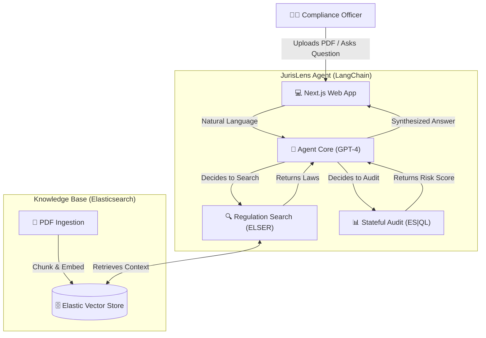

# 🏛️ Elastic JurisLens

> **Next-Gen Compliance Guardian Powered by Elasticsearch**

## 🚀 The Concept
Financial regulations and legal statutes are dense, complex, and constantly changing. **JurisLens** acts as an intelligent compliance officer that:
1.  **Ingests** massive legal documents (PDFs, statutes, internal policies) into an **Elasticsearch Vector Store**.
2.  **Understands** natural language queries using **ELSER v2** for deep semantic rigor.
3.  **Reasons** across documents and live database state using **ES|QL** to provide cited, accurate answers and prevent sanctions.

---

## 🛠️ Tech Stack
*   **Knowledge Base:** Elasticsearch (ELSER v2 + ES|QL Hybrid Search)
*   **AI Engine:** OpenAI GPT-4 Omni / Elastic Agent Builder
*   **Orchestration:** LangChain / Elastic Agent Framework
*   **Frontend:** Next.js 15 (App Router)

---

## 🏗️ Architecture

---

## 📽️ Demo & Submission
- **Live Application:** [https://jurislens.vercel.app/](https://jurislens.vercel.app/)
- **Demo Video:** [Watch on YouTube](https://youtu.be/Fe4deVq3YLM)
- **Problem Solved:** Prevents "State-Blindness" in compliance by bridging static policy with live transaction data.

---

## 🔮 Project Status
- [x] Ingest functionality for PDF/Text documents.
- [x] Vector Indexing pipeline (ELSER v2).
- [x] Agentic RAG interface with ES|QL integration.
- [x] Premium Dashboard UI.

---

## ⚖️ License
This project is licensed under the **MIT License** - an OSI-approved open-source license. See the [LICENSE](LICENSE) file for details.
